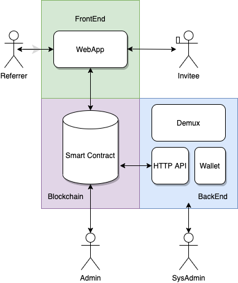

<p align="center">
   
</p>

# Proton Affiliate Platform
**An on-chain affiliate marketing platform, rewarding users in XPR for referring and registering on Proton.**

    

## Table of Contents

- [Tech Stack](#tech-stack)
- [Smart Contract](#smart-contract)
- [Demux Pattern](#demux-pattern)
- [Installation](#installation)
- [File Structure](#file-structure)
- [Technical Documentation](#technical-documentation)
  - [Infrastructure Diagram](#infrastructure-diagram)
  - [Web Application](#web-application)
  - [Hapi REST Server](#hapi-rest-server)
  - [EOSIO Blockchain Integration](#eosio-blockchain-integration)
- [License](#license)
- [Contributing](#contributing)
  - [Contributors](#contributors)
  - [About EOS Costa Rica](#about-eos-costa-rica)

## Tech Stack

This application features the following tech stack :

- **React JS** : A Front End Web Application Framework.
- **Hapi** : Node JS HTTP API.
- **Demux** : Deterministic event-sourced state and side effect handling.
- **KEOSD** : Wallet service daemon for storing private keys and signing digital messages.
- **EOSIO** : Blockchain protocol with industry-leading transaction speed.
- **Kubernetes** : Docker Container Orchestration.

<p align="center">
   
</p>

## Smart Contract

The **afiliate** smart contract will store referral info, validation info, and issue rewards for a successfully validated referral.

### Smart Contract Docs

For more information on the smart contract design for thi POC please see the [smart contract readme](contracts/affiliate/README.md).

## Demux Pattern

[Demux](https://github.com/EOSIO/demux-js) is a backend infrastructure pattern for sourcing blockchain events to deterministically update queryable datastores and trigger side effects.

We use the demux pattern's ability for blockchain events to trigger new transactions, as well as other side effects outside of the blockchain. The blockchain as the single source of truth for all application state

### Services Using Demux

Backend services execute the following smart contract actions triggered by demux updaters. The custom permission `affiliate@verify` is created for the smart contract account so that keys stored in wallet service can can only call the following actions.

- **Account Registration** Triggers `verifyacc` action that updates referral when invitee registers a new account.

- **Account KYC** Triggers `verifykyc` action that updates referral when invitee completes KYC for a new account.

### Demux Data Flow

<p align="center">
   
</p>

1. Client sends transaction to blockchain
1. Action Watcher invokes Action Reader to check for new blocks
1. Action Reader sees transaction in new block, parses actions
1. Action Watcher sends actions to Action Handler
1. Action Handler processes actions through Updaters and Effects
1. Actions run their corresponding Updaters, updating the state of the Datastore
1. Actions run their corresponding Effects, triggering external events
1. Client queries API for updated data

# Installation

## Before you Start

Somethings you need before getting started:

- [git](https://git-scm.com/)
- [node.js](https://nodejs.org/es/)
- [docker](https://www.docker.com/)
- [docker-compose](https://docs.docker.com/compose/)

## First Time

Copy the `.env.example` then update the environment variables according to your needs.

```
cp .env.example .env
```

## Quick Start

1.  Clone this repo using `git clone --depth=1 https://github.com/eoscostarica/proton-affiliate.git <YOUR_PROJECT_NAME>`.
2.  Move to the appropriate directory: `cd <YOUR_PROJECT_NAME>`.
3.  Run `make run` in order to start the project using docker compose.

At this point you can navigate to `http://localhost:3000`.

# File Structure

Within this repository you will find the following directories and files:

```
.
├── contracts ..................... EOSIO Smart Contracts
│   └── affiliate ................. Affiliate Platform Contract
├── docs .......................... Documentation
│   └── img ....................... Images and Diagrams
├── hapi .......................... Node JS backend & HTTP API 
│   └── src
│       └── services
|           └── demux ............. Demux Implementation
├── kubernetes .................... Kubernetes Manifests
├── utils ......................... Makefiles for project build
├── wallet ........................ EOSIO Wallet Service
└── webapp ........................ ReactJS Web Application
```

# Technical Documentation

### EOSIO Blockchain Integration

This project is being developed on the [Proton Testnet](https://proton-testnet.eosio.online/) using the [`affiliate`](https://proton-test.bloks.io/account/affiliate) smart contract account. The backend service is currently using [EOS Costa Rica's testnet API Node](https://proton-testnet.eosio.cr/v1/chain/get_info)

We use the [EOS JS](https://github.com/EOSIO/eosjs) javascript API for integration with EOSIO-based blockchain networks using EOSIO RPC API.

EOS JS documentation can be found [here](https://developers.eos.io/manuals/eosjs/latest/index)

### Web Application

This FullStack Template uses [React.js](https://reactjs.org) as a Frontend Library which together with other tools like [Apollo Client](https://www.apollographql.com/docs/react/), [GraphQL](https://graphql.org/) and [Material UI](https://material-ui.com/) brings a robust solution for building Single Page Applications out of the box.

<!--#### Hasura GraphQL Engine

[Hasura](https://hasura.io/) technology maps a [PostgreSQL](https://www.postgresql.org/) database and provides a reliable and easy-to-use API. This allow us to focus on critical features of our projects, delegating mechanic CRUD (Create, Read, Update, Delete) operations.
Hasura also enables custom REST handling capabilities with the possibility to integrate a custom REST server, that way we can extend the base CRUD functionalities and build custom business logic.-->

#### Hapi REST Server

We need to handle REST custom requests coming from the Hasura GraphQL server. For this, we use [hapi.dev](https://hapi.dev/), which is a simple and easy-to-use backend framework.

# License

MIT © [EOS Costa Rica](https://eoscostarica.io).

# Contributing

Please read EOS Costa Rica's [Open Source Contributing Guidelines](https://developers.eoscostarica.io/docs/open-source-guidelines).

Please report bugs big and small by [opening an issue](https://github.com/eoscostarica/proton-affiliate/issues)

## Contributors

Thanks goes to these wonderful people ([emoji key](https://github.com/kentcdodds/all-contributors#emoji-key)):

<table>
  <tr>
    <td align="center"><a href="https://github.com/xavier506"><br /><sub><b>Xavier Fernandez</b></sub></a><br /><a href="#ideas-xavier506" title="Ideas, Planning, & Feedback">🤔</a> <a href="#blog-xavier506" title="Blogposts">📝</a> <a href="#talk-xavier506" title="Talks">📢</a> <a href="#infra-xavier506" title="Infrastructure (Hosting, Build-Tools, etc)">🚇</a></td>
 <td align="center"><a href="https://github.com/tetogomez">
      <br /><sub><b>Teto Gomez</b></sub></a><br /><a href="https://github.com/eoscostarica/eosrate/commits?author=tetogomez" title="Ideas, Planning, & Feedback">🤔</a> <a href="https://github.com/eoscostarica/eosrate/commits?author=tetogomez" title="Code">💻</a> <a href="#review-tetogomez" title="Reviewed Pull Requests">👀</a></td>
      <td align="center"><a href="https://github.com/adriexnet">
      <br /><sub><b>Adriel Diaz</b></sub></a><br /><a href="https://github.com/eoscostarica/eosrate/commits?author=adriexnet" title="Ideas, Planning, & Feedback">🤔</a> <a href="https://github.com/eoscostarica/eosrate/commits?author=adriexnet" title="Code">💻</a> <a href="#review-adriexnet" title="Reviewed Pull Requests">👀</a></td>
  </tr>
</table>

This project follows the [all-contributors](https://github.com/kentcdodds/all-contributors) specification. Contributions of any kind welcome!

## About EOS Costa Rica

<p align="center">
	<a href="https://eoscostarica.io">
		
	</a>
</p>
<br/>

EOS Costa Rica is an independently-owned, self-funded, bare-metal Genesis block producer that provides stable and secure infrastructure for EOSIO blockchains. We support open source software for our community while offering enterprise solutions and custom smart contract development for our clients.

[eoscostarica.io](https://eoscostarica.io)
