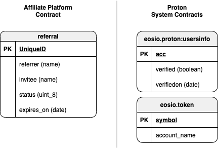

<p align="center">
   
</p>

# Affiliate Platform Smart Contract
**An on-chain affiliate marketing platform, rewarding users in XPR for referring and registering on Proton.**

View [project readme](../../README.md) document.

The **affiliate** smart contract will store referral info, validation info, and issue rewards for a successfully validated referral.

## User Story

@benobi invites crystalrose@gmail.com via the earnproton.com website, then if crystal converts to a real user ( @anything ) in 72 hours then ben is the parent of crystal and will get the reward when crystal KYCs. Crystal will also get a reward for signing up.

## Data Model

Data persisted in the smart contract multi index tables

<p align="center">
   
</p>

### Referral Status

```
  PENDING_USER_REGISTRATION = 1
  PENDING_KYC_VERIFICATION = 2
  PENDING_PAYMENT = 3
  PAYMENT_REJECTED = 4
  EXPIRED = 5
  PAID = 6
```

### User Roles

```
  ADMIN = 1
  REFERRER = 2
```

## Actions

|    User Role    |   Action    |        Description         |               Pre Conditions                 |          Post Conditions            |
| :-------------: | :---------: | :-----------------------:  | :-----------------------------------------:  | :-------------------------------:   |
| Smart Contract  | `addadmin`  | Grant Admin Permission     | Account must exist and be KYC verified       | Admin actions enabled for account   |
| Smart Contract  | `rmadmin`   | Revoke Admin Permission    | Account must be registered admin             | Admin actions disabled for account  |
| Admin           | `adduser`   | Grant Referral Permission  | Account must exist and be KYC verified       | Referral link enabled for user      |
| Admin           | `rmuser`    | Revoke Referral Permission | Account must be registered referrer          | Referral link disabled for user     |
| Referrer        | N/A         | Share Referral Link        | Referral permission granted                  | Link shared through social networks |
| Invitee         | `addref`    | Accept Referral            | Account doesn't exist & not already referred | Referral added to table with status "PENDING_USER_REGISTRATION" |
| Backend Service | `verifyacc` | Verify when account used as invitee in a referral it's created | Referral exists with status "PENDING_USER_REGISTRATION" && Referral hasn't expired | Referral status set to "PENDING_KYC_VERIFICATION" |
| Backend Service | `verifykyc` | Verify when account used as invitee in a referral it's marked as verified in `eosio.proton` :: `usersinfo` table | Referral exists with status "PENDING_KYC_VERIFICATION" && Referral hasn't expired | Referral status set to "PENDING_PAYMENT" |
| Backend Service | `verifyexp` | Change the status for expired referrals | Referral exists with status "PENDING_USER_REGISTRATION" or "PENDING_KYC_VERIFICATION" | Referral status set to "EXPIRED" |
| Admin | `payref` | Approve Referral | Referral exists with status “PENDING_PAYMENT” | Pay the rewards and set the referral status to "PAID" |
| Admin | `rejectref` | Reject Referral | Referral exists with status “PENDING_PAYMENT” | Referral status set to "PAYMENT_REJECTED" |
| Smart Contract  | `setparams` | Set the systems params to be used in the payment process | None | Set the account that will pay for the referrals, the reward amount to pay (USD), the exchange rate and the days before a referral expires |
| Backend Service | `setrate` | Update the exchange rate used to paid the reward amount | None |  Calculate the `asset_reward_amount` to pay using the new rate |
| Backend Service | `clearref` | Clear expired, paid and rejected referrals to save RAM | Referral exists with status “PAYMENT_REJECTED”, "EXPIRED" or “PAID” |  Calculate the `asset_reward_amount` to pay using the new rate |
| Smart Contract | `clear` | Clear Tables | For development purposes only | All records were deleted from all tables |

#### Params

Referral system configuration parameters set by smart contract account.

- **payer** : Account that holds token balance _(name)_
- **rate** : Exchange rate used to convert from USD to XPR _(double)_
- **usd_reward_amount** : Amount of USD rewarded _(double)_
- **asset_reward_amount** : Amount of XPR rewarded is calculated using rate and usd_reward_amount _(asset)_
- **expiration_days** : Time period in days for referal expiration _(uint8_t)_

### Admin Roles Appointed by Committee

- Smart Contract Account can update config params
- SysAdmin hosts backend service infrastructure
