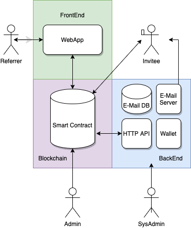

<p align="center">
   
</p>

# Affiliate Platform Smart Contract
**An on-chain affiliate marketing platform, rewarding users in XPR for referring and registering on Proton.**

View [project readme](../../README.md) document.

The **affiliate** smart contract will store referral info, validation info, and issue rewards for a successfully validated referral.

## User Story

@benobi invites crystalrose@gmail.com via the earnproton.com website, then if crystal converts to a real user ( @anything ) in 72 hours then ben is the parent of crystal and will get the reward when crystal KYCs. Crystal will also get a reward for signing up.

## Data Model

Data persisted in the smart contract multi index tables

<p align="center">
   
</p>

### Referal Status

```
  PENDING_USER_REGISTRATION = 1
  PENDING_KYC_VERIFICATION = 2
  PENDING_PAYMENT = 3
  PAYMENT_REJECTED = 4
  EXPIRED = 5
  PAID = 6
```

### User Roles

```
  ADMIN = 1
  REFERRER = 2
```

## Actions

|    User Role    |   Action    |        Description        |               Pre Conditions                |          Post Conditions          |
| :-------------: | :---------: | :-----------------------: | :-----------------------------------------: | :-------------------------------: |
| Smart Contract  | `addadmin`  |  Grant Admin Permission   |       Account must exist and be KYCd        | Admin actions enabled for account |
| Smart Contract  |  `rmadmin`  |  Revoke Admin Permission  |      Account must be registered admin       |   Referal link enabled for user   |
|      Admin      |  `adduser`  | Grant Referal Permission  |       Account must exist and be KYCd        |   Referal link enabled for user   |
|      Admin      |  `rmuser`   | Revoke Referal Permission |     Account must be registered referrer     |  Referal link disabled for user   |
|    Referrer     |     N/A     |    Share Referal Link     |         Referral permission granted         |   Email sent with register link   |
|     Invitee     |  `addref`   |      Accept Referral      | Account doesnt exist & not already referred |     Referreral added to table     |
| Backend Service | `verifyacc` |  Verify when account used as invitee in a referral it's created   |    Referral exists with status "PENDING_USER_REGISTRATION" && Referral hasnt expired    |  Referral status set to "PENDING_KYC_VERIFICATION"  |
| Backend Service | `verifykyc` |  Verify when account used as invitee in a referral it's marked as verified in `eosio.proton` - `usersinfo` table   |    Referral exists with status "PENDING_KYC_VERIFICATION" && Referral hasnt expired | Referral status set to "PENDING_PAYMENT" |
| Backend Service | `expireref` | Delete Expired Referrals  |          Referral hasn’t been paid          |         Referral deleted          |
|      Admin      |  `payref`   |      Manual Approval      |    KYC completed & Referal hasnt expired    |          Token Transfer           |
|      Admin      | `rejectref` |      Reject Referral      |          Referral hasn’t been paid          |         Referral deleted          |
| Smart Contract  | `setparams` |       System Config       |                    None                     |Set the account that will pay for the referrals, the rewards amount to pay and the days before a referral expires|
| Smart Contract  |   `clear`   |       Clear Tables        |                                             |                                   |

#### Params

Referral system configuration parameters set by smart contract account.

- **payer** : Account that holds token balance _(name)_
- **reward_amount** : Amount of tokens rewarded _(asset)_
- **expiration_days** : Time period for referal expiration _(datetime)_

## Services Architecture

In order to send emails and to store the email addresses "off chain" we would need some backend services , meaning someone would have to host the email server and database

<p align="center">
     
</p>

### Admin Roles Appointed by Committee

- Smart Contract Account can update config params
- SysAdmin hosts backend service and email server
